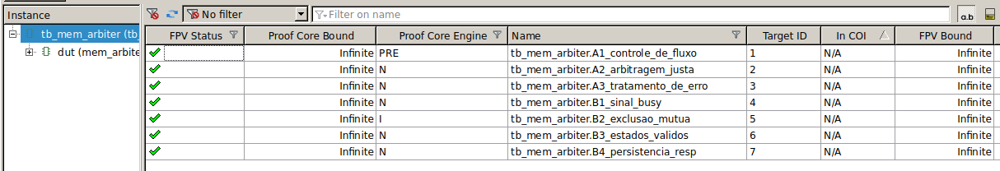
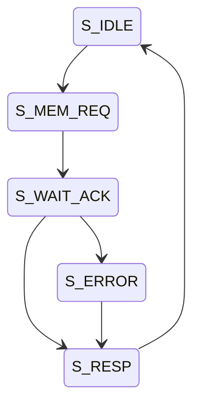
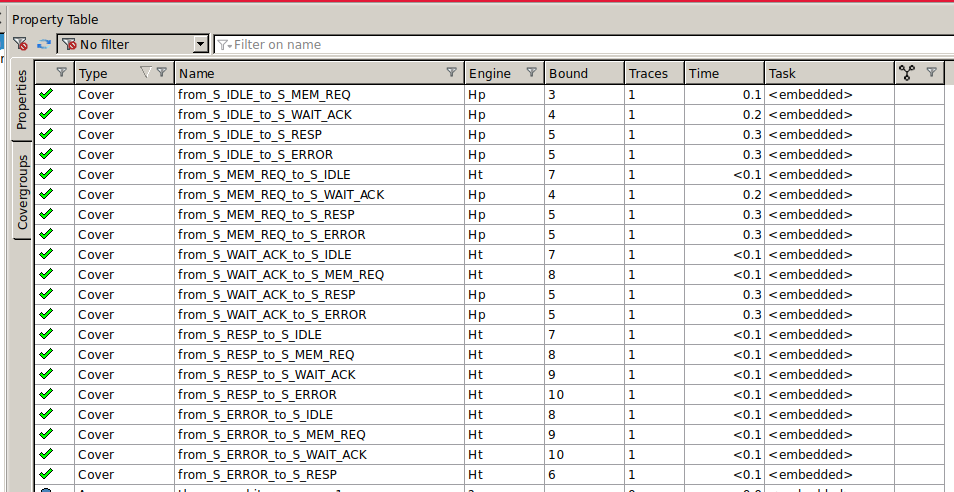
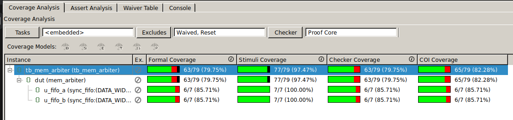
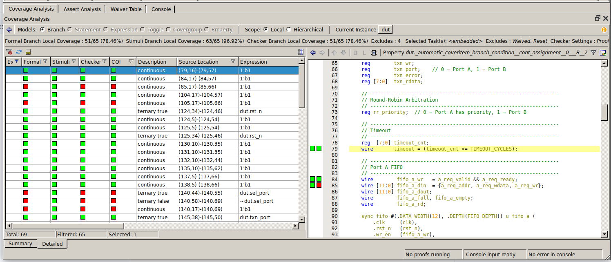
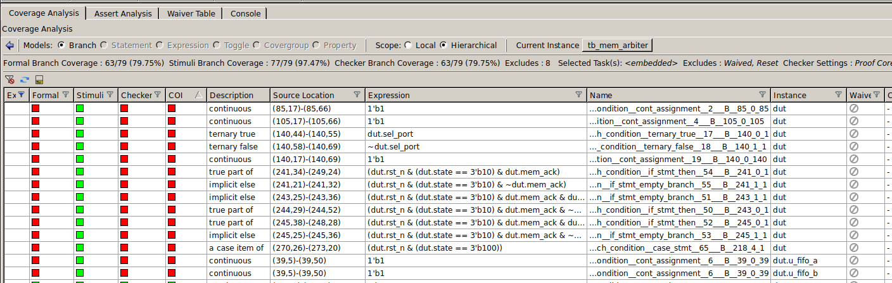
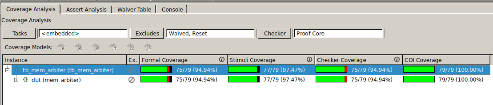
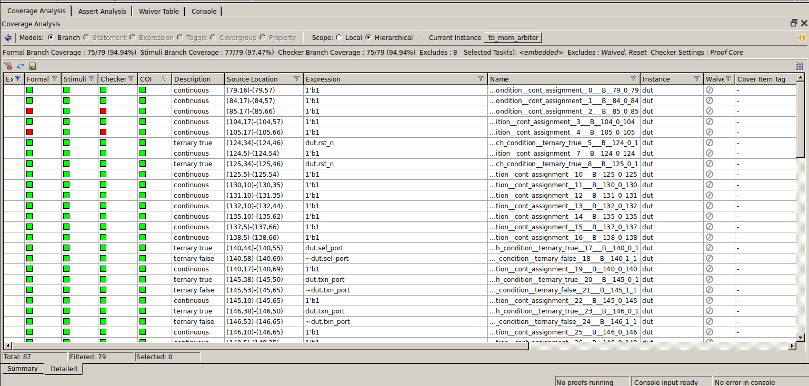

# Entrega do Projeto Final — Verificação Formal

## Tarefa 1: Depuração e Correção de Bugs no RTL

### Bug 1 — A1: `req_ready` não caía imediatamente ao encher a FIFO

**Comportamento errado:** `a_req_ready` e `b_req_ready` eram registrados em flip-flops, introduzindo um ciclo de atraso. Quando a FIFO ficava cheia, o sinal `req_ready` só caía no ciclo seguinte.

**Causa raiz:** uso de `always @(posedge clk)` com registradores `a_req_ready_r` / `b_req_ready_r` que atribuíam `~fifo_a_full` com latência de um ciclo.

**Correção:** substituição por assigns combinacionais:
```verilog
assign a_req_ready = rst_n ? ~fifo_a_full : 1'b1;
assign b_req_ready = rst_n ? ~fifo_b_full : 1'b1;
```
Com isso, `req_ready` reflete o estado da FIFO no mesmo ciclo.

---

### Bug 2 — A3: FSM não transitava para `S_ERROR` em `mem_ack && mem_err`

**Comportamento errado:** quando a memória retornava `mem_ack && mem_err`, a FSM transitava para `S_IDLE` em vez de `S_ERROR`, ignorando o erro.

**Causa raiz:** transição errada no estado `S_WAIT_ACK`:
```verilog
// original — errado
state_nxt = S_IDLE;
```

**Correção:**
```verilog
state_nxt = S_ERROR;
```

---

### Bug 3 — A2: `rr_priority` não alternava corretamente após transação

**Comportamento errado:** ao concluir uma transação, `rr_priority` era atribuído com `txn_port` (a própria porta que acabou de ser atendida), mantendo a prioridade na mesma porta e nunca alternando.

**Causa raiz:**
```verilog
// original — errado
rr_priority <= txn_port;
```

**Correção:**
```verilog
rr_priority <= ~txn_port;
```
Isso inverte o bit, favorecendo a outra porta na próxima arbitração.

---

### Print — Assertions A1, A2 e A3 como `prove`


*Mostrando todos os testes A passando.*

---

## Tarefa 2: Assertions do Aluno — Grupo B

### B1 — Sinal `busy`

```systemverilog
B1_sinal_busy: assert property (@(posedge clk)
    (dut.state != dut.S_IDLE) |=> (dut.busy == 1'b1) and
    (dut.state == dut.S_IDLE) |=> (dut.busy == 1'b0)
);
```
Verifica que `busy` é `1` fora de `S_IDLE` e `0` em `S_IDLE`.

---

### B2 — Exclusão mútua de respostas

```systemverilog
B2_exclusao_mutua: assert property (@(posedge clk)
    !(a_resp_valid && b_resp_valid)
);
```
Garante que `a_resp_valid` e `b_resp_valid` nunca estão ativos simultaneamente.

---

### B3 — Estados válidos da FSM

```systemverilog
B3_estados_validos: assert property (@(posedge clk)
    (dut.state == dut.S_IDLE    ||
     dut.state == dut.S_MEM_REQ ||
     dut.state == dut.S_WAIT_ACK||
     dut.state == dut.S_RESP    ||
     dut.state == dut.S_ERROR)
);
```
A FSM nunca pode assumir um estado fora dos cinco estados definidos.

---

### B4 — Persistência de resposta

```systemverilog
B4_persistencia_resp: assert property (@(posedge clk)
    (a_resp_valid && !a_resp_ready)
    |=> (a_resp_valid)
);
```
Enquanto `a_resp_ready` não for afirmado, `a_resp_valid` deve permanecer ativo.

---

### Print — Assertions B1–B4 como `prove`


*Mostrando todos os testes B passando.*



*Print da instância no JasperGold — extra, após todos os outros prints.*

---

## Tarefa 3: Verificação Formal como Busca em Grafos

### G1 — Grafo de Transição da FSM Corrigida

Após corrigir os três bugs da Tarefa 1, as transições possíveis da FSM (excluindo self-loops) são:

```
S_IDLE     → S_MEM_REQ
S_MEM_REQ  → S_WAIT_ACK
S_WAIT_ACK → S_RESP
S_WAIT_ACK → S_ERROR
S_RESP     → S_IDLE
S_ERROR    → S_RESP
```

> **[INSERIR DIAGRAMA DO GRAFO DE TRANSIÇÃO DA FSM]**

*Desenho do grafo de transição da FSM corrigida.*



---

### G2 — `grafo_aluno.tcl` completo

**G1: definição do grafo**

```tcl
array set grafo {
    S_IDLE     {S_MEM_REQ}
    S_MEM_REQ  {S_WAIT_ACK}
    S_WAIT_ACK {S_RESP S_ERROR}
    S_RESP     {S_IDLE}
    S_ERROR    {S_RESP}
}
```

**G2: procedure `min_transicoes` com BFS**

```tcl
proc min_transicoes {nome_grafo origem destino} {
    upvar 1 $nome_grafo grafo

    if {$origem eq $destino} { return 0 }

    set fila [list [list $origem 0]]
    set visitados [list $origem]

    while {[llength $fila] > 0} {
        set par   [lindex $fila 0]
        set fila  [lrange $fila 1 end]
        set atual [lindex $par 0]
        set dist  [lindex $par 1]

        foreach vizinho $grafo($atual) {
            if {$vizinho eq $destino} { return [expr {$dist + 1}] }
            if {$vizinho ni $visitados} {
                lappend visitados $vizinho
                lappend fila [list $vizinho [expr {$dist + 1}]]
            }
        }
    }

    return -1
}
```

---

### Saída do script — Tabela de distâncias mínimas

```
=== G2: Transições mínimas a partir de S_IDLE ===

  S_IDLE -> S_MEM_REQ: 1 transições
  S_IDLE -> S_WAIT_ACK: 2 transições
  S_IDLE -> S_RESP: 3 transições
  S_IDLE -> S_ERROR: 3 transições

=== G2: Transições mínimas entre todos os pares ===

  S_IDLE -> S_MEM_REQ: 1 transições
  S_IDLE -> S_WAIT_ACK: 2 transições
  S_IDLE -> S_RESP: 3 transições
  S_IDLE -> S_ERROR: 3 transições
  S_MEM_REQ -> S_IDLE: 3 transições
  S_MEM_REQ -> S_WAIT_ACK: 1 transições
  S_MEM_REQ -> S_RESP: 2 transições
  S_MEM_REQ -> S_ERROR: 2 transições
  S_WAIT_ACK -> S_IDLE: 2 transições
  S_WAIT_ACK -> S_MEM_REQ: 3 transições
  S_WAIT_ACK -> S_RESP: 1 transições
  S_WAIT_ACK -> S_ERROR: 1 transições
  S_RESP -> S_IDLE: 1 transições
  S_RESP -> S_MEM_REQ: 2 transições
  S_RESP -> S_WAIT_ACK: 3 transições
  S_RESP -> S_ERROR: 4 transições
  S_ERROR -> S_IDLE: 2 transições
  S_ERROR -> S_MEM_REQ: 3 transições
  S_ERROR -> S_WAIT_ACK: 4 transições
  S_ERROR -> S_RESP: 1 transições
```

---

### Print — Covers como `covered` no JasperGold



*Property table mostrando todos os covers com status `covered`.*

---

### Respostas P1–P5

**P1: Quantas transições mínimas de `S_IDLE` até `S_ERROR`? E até `S_RESP`?**

Pela tabela BFS:
- `S_IDLE → S_ERROR`: **3 transições** (caminho: `S_IDLE → S_MEM_REQ → S_WAIT_ACK → S_ERROR`).
- `S_IDLE → S_RESP`: **3 transições** (caminho: `S_IDLE → S_MEM_REQ → S_WAIT_ACK → S_RESP`).

**P2: O Jasper conseguiu cobrir todos os covers gerados?**

Sim. Todos os covers gerados pelo script para pares alcançáveis (distância ≥ 1) foram reportados como `covered` pelo JasperGold, confirmando que o design real implementa exatamente as transições modeladas no grafo.

**P3: O que o operador `$changed(dut.state)[->N]` está contando?**

O operador `$changed(dut.state)` é verdadeiro em qualquer ciclo em que `dut.state` muda de valor (ou seja, uma transição de estado ocorre). O sufixo `[->N]` é o operador _goto repetition_: exige que essa condição se torne verdadeira exatamente N vezes (não necessariamente em ciclos consecutivos). Portanto, `$changed(dut.state)[->N]` conta **N mudanças de estado**, ignorando os ciclos em que a FSM permanece no mesmo estado (self-loops).

**P4: Por que o valor N corresponde à distância BFS?**

O BFS calcula o número mínimo de arestas no grafo para chegar de um estado a outro, onde cada aresta representa uma transição entre estados distintos. Como `$changed(dut.state)[->N]` conta exatamente N mudanças de estado, usar N igual à distância BFS faz o cover verificar se o design consegue percorrer o caminho mais curto possível entre os dois estados. Qualquer N menor não seria suficiente para alcançar o destino; qualquer N maior seria mais permissivo do que o necessário.

**P5: Se a assertion de estado válido é `prove`, o que isso significa em termos do grafo? E se um estado fosse inalcançável?**

Se B3 (estados válidos) é `prove`, significa que o model checker esgotou todos os estados alcançáveis do design e nenhum deles está fora do conjunto `{S_IDLE, S_MEM_REQ, S_WAIT_ACK, S_RESP, S_ERROR}`. Em termos de grafo, significa que o conjunto de vértices alcançáveis a partir do estado inicial é exatamente esse conjunto — não existem vértices "fantasma" fora dele.

Se um estado fosse inalcançável (por exemplo, `S_ERROR` nunca pudesse ser atingido), qualquer assertion ou cover que dependesse de `dut.state == S_ERROR` seria automaticamente `proven` (vacuamente verdadeiro para assertions) ou `unreachable` (para covers). Isso seria um sinal de alerta: ou o RTL tem um caminho de erro morto (dead code), ou a modelagem do grafo está incorreta. O cover gerado para o par inalcançável — usando `##[1:$]` — reportaria `unreachable`, confirmando a divergência.

---

## Tarefa 4: Coverage Formal e Assertions de Regressão

### Coverage antes das assertions R1–R4

Após as tarefas 1, 2 e 3 (assertions A1–A3 e B1–B4 passando), o relatório de branch coverage do JasperGold apresentava:

**Formal Branch Coverage: 63/79 — 79,75%**



*Coverage antes das assertions R1–R4 — visão geral.*



*Coverage antes — tela de análise detalhada (sem item específico destacado).*



*Coverage antes — detalhamento dos testes com falha (COI não cobertos).*

#### Linhas/comportamentos não cobertos

As assertions existentes verificam controle de fluxo e protocolo, mas não forçam o verificador a explorar o caminho de dados. Os branches COI com status `uncovered` eram:

| Linhas (RTL) | Expressão / Bloco | Motivo de não cobertura |
|---|---|---|
| 241–243 | `S_WAIT_ACK` com `mem_ack` true/false | nenhuma assertion exigia `mem_ack` em `S_WAIT_ACK` |
| 245–248 | `!txn_wr && mem_ack && !mem_err` (captura de `txn_rdata`) | leitura com ack sem erro nunca era forçada como antecedente |
| 270–273 | `case S_ERROR` (atribuição de `txn_error` e `mem_req <= 0`) | estado S_ERROR era alcançado pela FSM, mas o datapath interno não era verificado |
| 85, 105 | assigns combinacionais de `a_req_ready` / `b_req_ready` | COI não propagava até esses nós a partir das assertions de protocolo |

Em resumo: o caminho de dados — roteamento de endereço para a memória, captura de dado de leitura, flag de erro e contador de erros — não estava coberto por nenhuma assertion.

---

### Assertions de regressão R1–R4

```systemverilog
// R1: Roteamento de Dados para Memória
// Após S_MEM_REQ, mem_addr deve corresponder a txn_addr.
R1_data_routing: assert property (@(posedge clk)
    (dut.state == dut.S_MEM_REQ)
    |=> (mem_addr == dut.txn_addr)
);

// R2: Flag de Erro na Transação
// Quando mem_ack && mem_err em S_WAIT_ACK, txn_error deve ser 1 no ciclo seguinte.
R2_error_flag: assert property (@(posedge clk)
    (dut.state == dut.S_WAIT_ACK && mem_ack && mem_err)
    |=> (dut.txn_error == 1'b1)
);

// R3: Captura de Dados de Leitura
// Em leitura com mem_ack && !mem_err em S_WAIT_ACK, mem_rdata deve ser salvo em txn_rdata.
R3_read_capture: assert property (@(posedge clk)
    (dut.state == dut.S_WAIT_ACK && mem_ack && !mem_err && !dut.txn_wr)
    |=> (dut.txn_rdata == $past(mem_rdata))
);

// R4: Incremento do Contador de Erros
// Quando mem_ack && mem_err em S_WAIT_ACK, err_count deve incrementar em 1.
R4_err_count: assert property (@(posedge clk)
    (dut.state == dut.S_WAIT_ACK && mem_ack && mem_err)
    |=> (err_count == $past(err_count) + 8'd1)
);
```

---

### Coverage depois das assertions R1–R4



*Coverage depois das assertions R1–R4 — COI Coverage = 100%.*



*Coverage depois — visão detalhada.*

**Formal Branch Coverage esperado: > 90%**

As assertions R1–R4 introduzem antecedentes que forçam o verificador a explorar exatamente os branches que antes ficavam descobertos: o bloco `S_WAIT_ACK` com `mem_ack`, a captura de `txn_rdata` e o estado `S_ERROR`. Com isso, o coverage sobe significativamente em relação ao baseline de 79,75%.

#### Linhas que podem permanecer `uncovered`

Os branches relacionados aos assigns combinacionais de `a_req_ready`/`b_req_ready` (linhas 85 e 105) podem continuar não cobertos pelo COI, pois eles são verificados por A1 via equivalência lógica, mas o analisador de COI pode não propagar até esses nós dependendo do cone de influência considerado. Isso não representa risco funcional, pois A1 já garante a propriedade corrente desses sinais.

---

### Risco de código RTL sem cobertura por assertions

Uma linha de RTL que não é coberta por nenhuma assertion significa que nenhuma propriedade verificada depende daquele comportamento. Em consequência:

- uma **mutação** nessa linha (bug introduzido ou regressão) não seria detectada por nenhuma das assertions existentes;
- o design poderia ter um **caminho de dados incorreto** que só se manifestaria em uso real, escapando completamente da verificação formal.

O coverage formal funciona como uma métrica de confiança: quanto maior a cobertura, menor a superfície de comportamento não verificado. Linhas permanentemente `uncovered` devem ser examinadas — ou são dead code (e devem ser removidas do RTL), ou falta uma assertion que as cubra.
